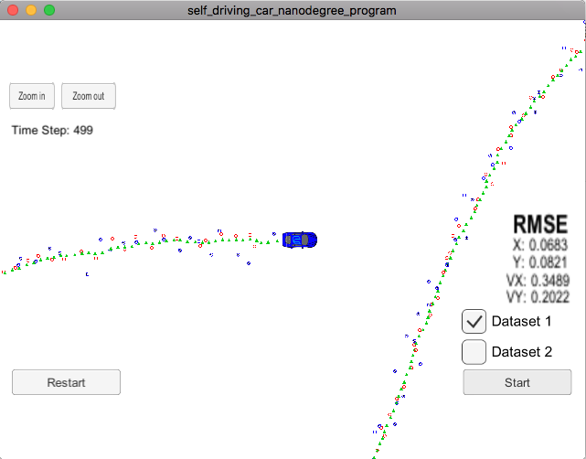

# Unscented Kalman Filters

This is the second project of the term 2 of the Self Driving Car Nanodegre.
The code provided during the quiz at the lessons was used as reference.

## Accuracy

The dataset used is "obj_pose-laser-radar-synthetic-input.txt". 
Requirement is that the px, py, vx, vy output coordinates must have an RMSE <= [.09, .10, .40, .30]. 
After fine tuning the parameters:

•	Process noise standard deviation longitudinal acceleration in m/s^2 = std_a_ = 1.2    
•	Process noise standard deviation yaw acceleration in rad/s^2 = std_yawdd_ = 0.4; 

The output coordinates have an RMSE=[0.068, 0.082, 0.348, 0.202].

## Follows the Correct Algorithm

The algorithm:
•	follows the general processing flow as taught in the preceding lessons.	
•	handles the first measurements appropriately. 
•	should predict object position to the current timestep and then update the prediction using the new measurement.
•	handles radar and lidar measurements.	

The algorithm has been tried to be coded using good practices.

## Conclusion

Thanks to the existing code from the lesson the codification has been simplified. However, I am starting to refresh my forgotten C knowledge and finally I have been able to accomplish the minimum requirements.

